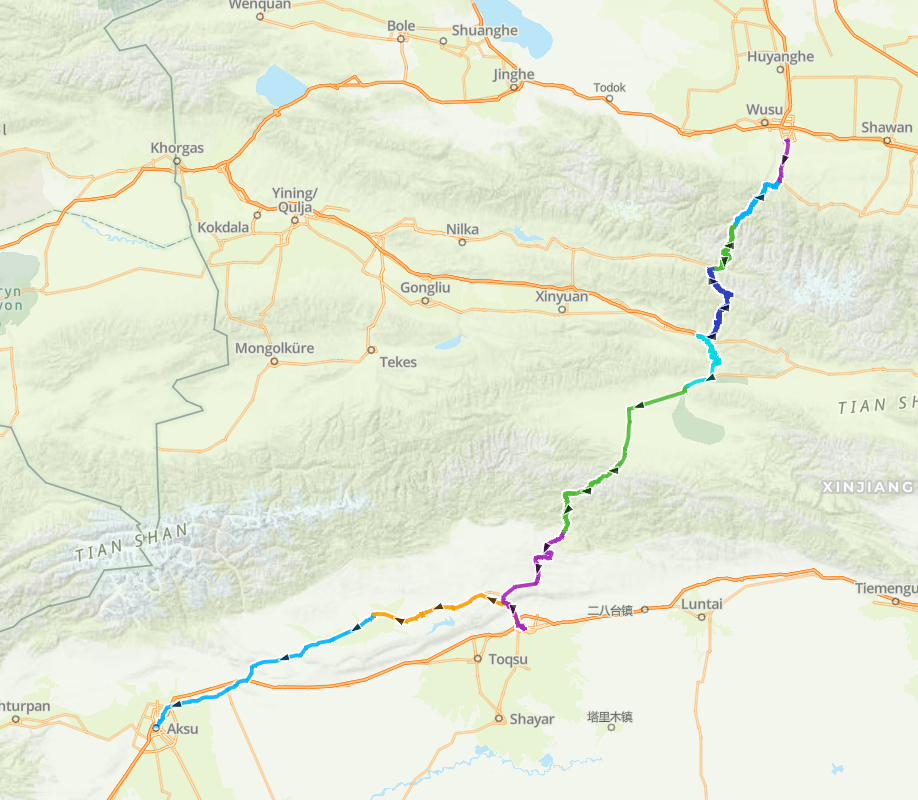

# 独库公路 560km 6d

<figure><figcaption></figcaption></figure>

路程里程：560km

路书：[gaiagps路书](https://www.gaiagps.com/map/?loc=6.3/80.6460/43.0645\&pubLink=7tPYwwrS1SHyGKemNAHFRPmz\&folderId=94c18bbe-bf7b-4b07-bdaa-b8d34d7b4e4b)

骑行强度：★★★★☆（满分5分，请评星）

路况指数：★★★★☆

风景评分：★★★★★★

路线亮点：一条路从北疆骑到南疆，能够看见一年四季的景色

推送参考链接：[https://mp.weixin.qq.com/s/ueRcI7l9TK1VExFN3hGtaQ](https://mp.weixin.qq.com/s/ueRcI7l9TK1VExFN3hGtaQ)

整理人：Kyre

## 行程介绍

概览：6 days, 79km/2000m - 54km/1500m - 83km/1000m - 110km/1200m - 110km/700m - 100km

day 1: 独山子-乌兰萨德克

day 2: 乌兰萨德克-乔尔玛

day 3: 乔尔玛-那拉提草原

day 4: 那拉提草原-巴音郭楞乡

day 5: 巴音郭楞乡-大小龙池

day 6: 大小龙池-库车
