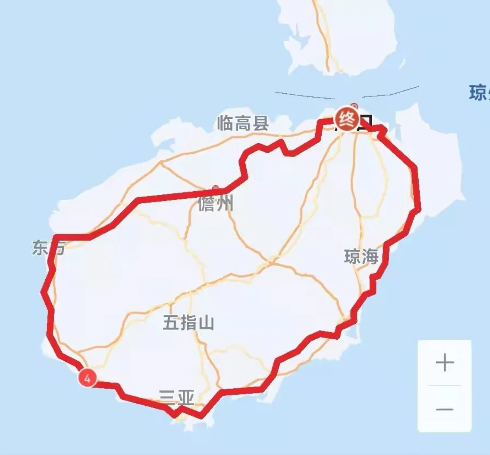

# 海南远征 770km 9d

<figure><figcaption></figcaption></figure>

路程里程：770km

行者路书号：#3084517

骑行强度：★★★☆☆（满分5分，请评星，在后面括号内加上给分理由）

路况指数：★★★★★

风景评分：★★★★★

推送参考链接：[https://mp.weixin.qq.com/s/zB0jBgDob\_4lLlYpbzmtsQ](https://mp.weixin.qq.com/s/zB0jBgDob\_4lLlYpbzmtsQ)

整理人：Kyre

## 行程安排

概览：9 days, 83km-81km-91km-74km-97km-40km-105km-125km-87km

（具体细节有待补充，参考推送链接）

### **day 1:** 海口-福山镇-多文镇&#x20;

83km

### **day 2:** 多文-儋州市-雅星镇&#x20;

81km

### **day 3:** 雅星镇-叉河镇-东方市

91km

### **day 4:** 东方市-佛罗镇&#x20;

74km

### **day 5:** 佛罗镇-崖城区-三亚市

97km

### **day 6:** 三亚市-海棠区&#x20;

40km + 下午自由活动

### **day 7:** 海棠区-陵水县-万宁市

105km

### **day 8:** 万宁市-博鳌镇-文昌市

125km

### **day 9:** 文昌市-美兰镇-海口市

87km



