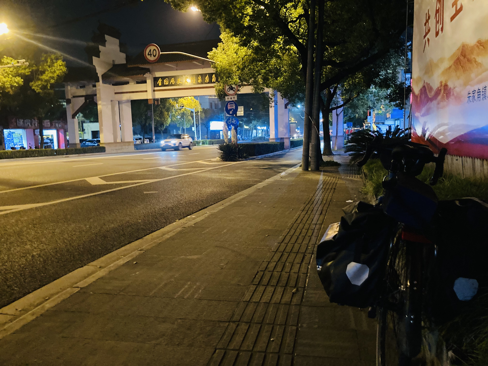
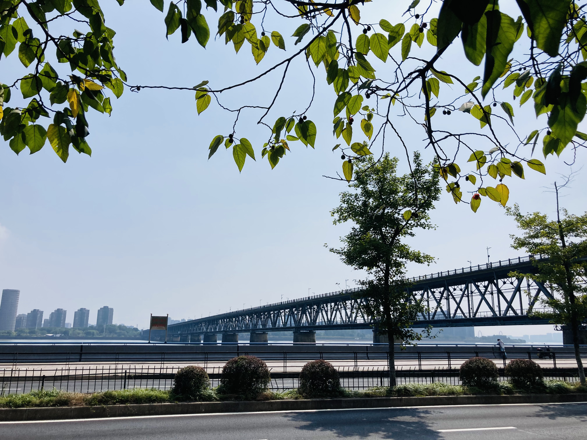

# 上海-千岛湖-宣城 700km 4-6d

总里程约700km，核心路段是千岛湖-宣城。时间不充裕的话，可以选择高铁到千岛湖开始骑。抵达宣城后，可以当晚坐卧铺回上海，也可以第二天早上坐大巴。

路线强度：★★★★★

路况指数：★★★★☆

风景评分：★★★★★（有更多★可以用吗）

路线亮点：躲避城市喧嚣，走向浙西和皖南的山区。在千岛湖边游泳，吃鱼头。乘客轮沿新安江北上，体验正宗徽派文化，抵达绩溪。继续北上，桃岭公路蜿蜒盘旋（皖南小川藏的一部分），体验爬山（自虐）的快乐。

## 行程介绍

概览：4 days，100km-230km/350m-100km/300m-170km/1800m

### day0: 上海-嘉兴



里程：100km

晚上从学校出发，走中山北路，沪青平公路，在朱家角（淀山湖）附近转朱枫公路到嘉兴。在嘉兴休息一晚。

这段平路很无聊，朱枫公路路况不错，部分路段没有路灯。

<figure><figcaption>
可以在朱家角镇觅食，搞点宵夜
</figcaption></figure>

### day1: 嘉兴-千岛湖



里程：230km

爬升：约350m

早点出发，干就完了。这段路也挺无聊，可以适应一下爬坡。在杭州市区不要停留太久。出临安区，沿着新淳线骑行（按导航走就行），晚上路灯不是很亮。注意带补给，尤其是水，路上除了加油站，没什么超市。

<figure><figcaption>
钱塘江大桥
</figcaption></figure>

### day2: 可以休息，也可以环千岛湖

千岛湖值得停留1天。

环千150km左右，顺时针环，有自行车道。笔者当时选择休息一天，在附近转了转。

<figure><figcaption></figcaption></figure>

<figure><figcaption></figcaption></figure>

### day3: 千岛湖-绩溪



里程：100km

爬升：300m（坐船版）

千岛湖-深渡镇有60km，可以选择坐客轮，看新安江美景（这条线路是徽杭古道的水上版本）。千岛湖-深渡镇的客轮中午12:30出发，16:30左右抵达深渡镇。船票60元，如果带自行车要加50元。

请注意，不想夜骑的朋友，可以选择在深渡镇住一晚。也可以早上出发，沿新安江骑行，这样就不会浪费上午的时间。

深渡镇-绩溪县，要经过山村小道，只能过摩托车的那种水泥路（此处批评高德导航）。此地风景秀丽，向往田园生活的朋友会很喜欢。

<figure><figcaption></figcaption></figure>

<figure><figcaption></figcaption></figure>

<figure><figcaption></figcaption></figure>

<figure><figcaption>
徽派建筑
</figcaption></figure>

 

### day4: 绩溪-宣城



里程：170km

爬升：1800m

今天比较虐。从绩溪出发，要先骑60km到榔桥镇，然后右拐进入宁泾路（s208）开始爬山。开爬之前，一定买好补给。

推荐在旌德县吃早饭，感受一下这里的物价。

今天大概率要夜骑，请把车灯充好电。天黑后下山的路回头弯不多，路很好。

晚上到达宣城后，可以直接卧铺回上海，也可以第二天早上坐大巴。

