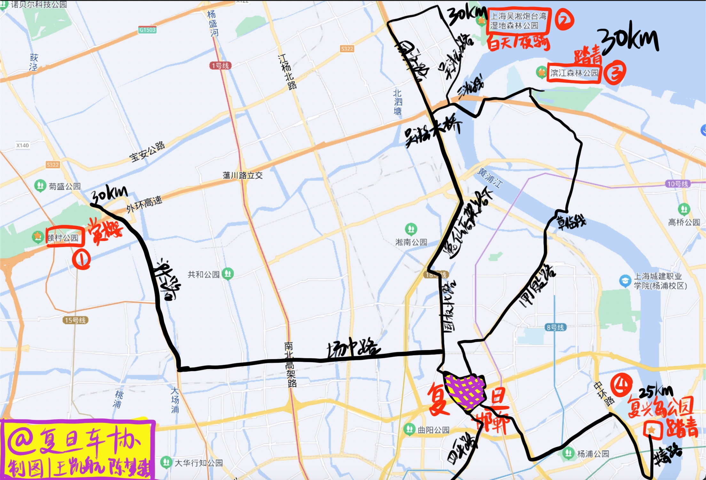

# 初出茅庐 (20-50km)

<figure><figcaption></figcaption></figure>

新手向骑行线路，蜿蜒于古老的森林与静谧的乡间小道之间，仿佛一条沉睡的巨龙，等待着勇敢的骑手去唤醒它的活力。在这片土地上，每一个转弯都蕴藏着未知的挑战与风景的变换，正如每个新手骑手的内心，充满了对未知的好奇和对自由的渴望。

传说中，这条线路是由一位神秘的长者所开辟，他曾在月光下独自骑行，探索着这片大地的秘密。他的身影如同幽灵一般在夜色中穿梭，留下的只有车轮的痕迹和风的低语。而如今，这些痕迹成为了指引，引领着每一位新手骑手踏上他们的旅程。

每当朝阳初升，第一缕阳光洒在这条线路上时，它便如同被赋予了生命，等待着新的骑手们来驾驭它。他们或许会在某个清晨出发，带着一颗跃跃欲试的心，踏上这条通往成长的道路。沿途的风景如画，既有宁静的湖泊倒映着天空的色彩，也有陡峭的山坡考验着骑手的意志。

然而，随着岁月的流转，这条线路也渐渐蒙上了一层神秘的面纱。有人说，在某个黄昏时分，曾看到一位穿着古老盔甲的骑士在这条线路上疾驰而过，他的身影迅速消失在夕阳的余晖中，只留下一串清脆的马蹄声回荡在空气中。这个传说让这条线路变得更加引人入胜，吸引着无数骑手前来探寻真相。

如今，这条新手向骑行线路依然静静地躺在那里，等待着下一个勇敢的骑手来揭开它的面纱。它不仅仅是一条道路，更是一个故事、一个传说和一个梦想的开始。在这里，每一位骑手都将书写属于自己的传奇篇章。
