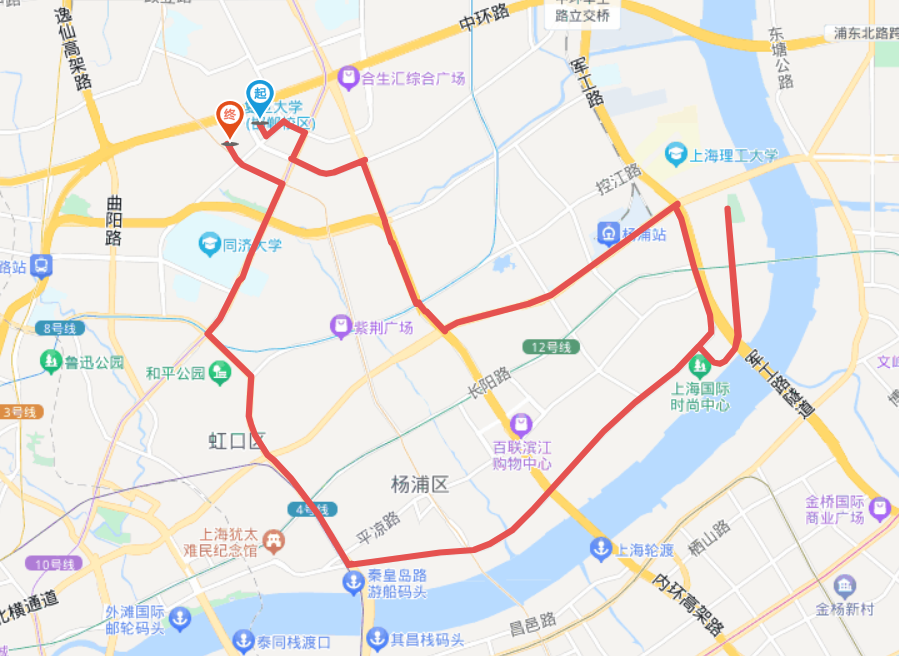

# 复兴岛 32km

<figure><figcaption></figcaption></figure>

路程里程：32km

行者路书号：#3144191

骑行强度：★☆☆☆☆

路况指数：★☆☆☆☆

风景评分：★★☆☆☆

建议出发时间/行程总耗时：晚上5:30/3h

去程：沿黄兴路向南-周家嘴路向东-军工路向南骑到定海路桥，然后沿共青路向北骑到\[复兴岛公园]。

返程：沿共青路向南骑回定海路桥，向西沿杨树浦路骑到大连路，然后向北【大连路-四平路】，回到复旦。

路线亮点：复兴岛夜景清幽静谧，岛上有一条主干道共青路，几乎无车，适合拉扯、放空。 道南端有一座桥定海路桥，可在桥上合影。

推送参考链接：N/A

整理人：郭子兴
