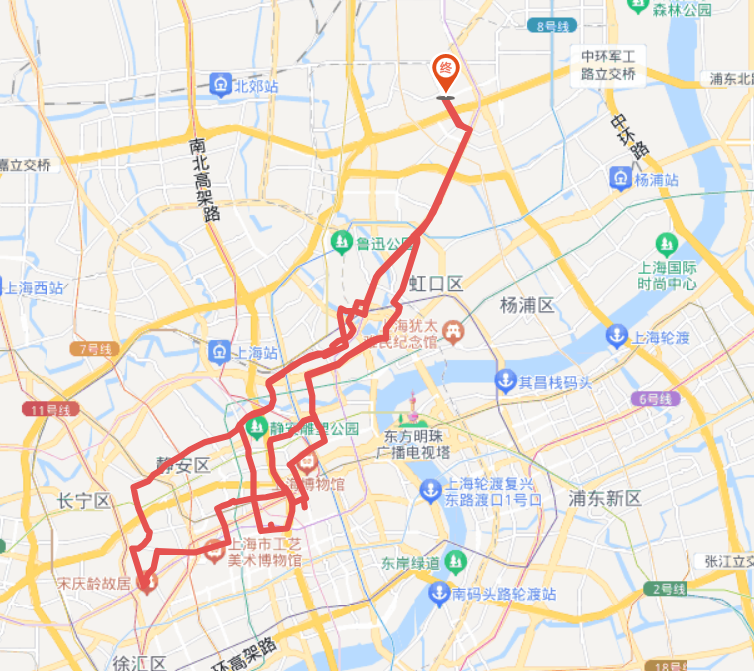

# 旧法租界赏秋 40km

<figure><figcaption></figcaption></figure>

路程里程：40km

行者路书号：#3095165（其他参考路书：#2705145 / #2977867）

骑行强度：★☆☆☆☆

路况指数：★★☆☆☆

风景评分：★★★☆☆

行程总耗时：约七个小时，早上8：00集合出发

去程：东校门出发-国定路-四平路（一路直行）——

——天宝路（和平公园旁）-物华路（一小段）-海拉尔路-海伦路-辽宁路-海宁路——

——沿乌镇路渡过苏州河，进入徐汇市区——新闸路—常德路—愚园路—愚园支路—乌鲁木齐北路—永福路—湖南路—康平路—宛平路—武康大楼（开启游玩）

约早上10：00到达法租界周边，之后将途经并游览武康大楼，宋庆龄故居，孙中山故居，思南公馆等地

午餐：约中午12：00在思南路附近（孙中山故居旁）自由活动，参与人员自行解决午饭

约中午1：00集合返程

返程：思南路—复兴东路—重庆南路—成都北路—新闸路—新桥路—大统路—海宁路—周家嘴路—沙泾路—太平桥支路—曲阳南路—四平路—国定路—复旦大学东门入

约中午3：00（+30min）到达邯郸校区，并集合拍照留念

路线亮点：去程和返程的路其实直接开高德地图也能走，而且由于上海沿路种的都是梧桐，所以无论怎么走一路都有金黄的梧桐相伴，秋天里阳光正好微风拂面时骑着相当惬意。

路况也都挺好的，最好周末早早起床开骑，这样路上行人会比较少。

徐汇区无论是文旅景点还是人文风情都很足，穿过没那么规整精致、热闹朴实的老城区和平坦宽阔、优雅时尚的现代都市，能充分感受整个上海的历史与文化随着一圈圈车轮滚滚在眼前徐徐展开。总之就是一整个休闲！！

推送参考链接：N/A

整理人：刘梓涵
