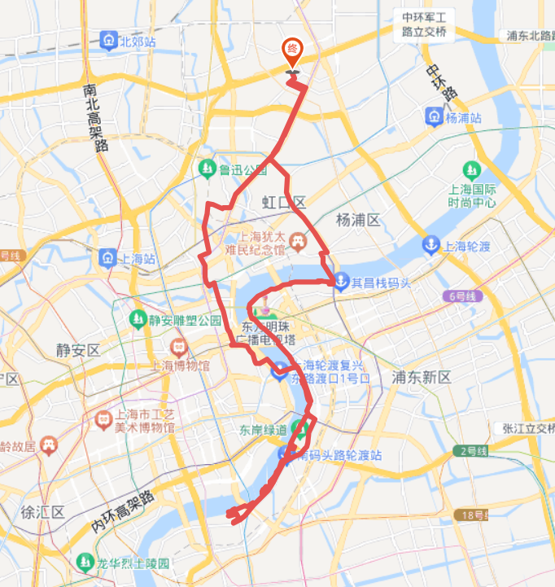

# 浦东滨江世博大道夜骑 35km

<figure><figcaption></figcaption></figure>

路程里程：35km

行者路书号：#3144292

骑行强度：★★★☆☆

路况指数：★★★★☆

风景评分：★★★★☆

建议出发时间/行程总耗时：晚饭后/3h

去程：【国权路、四平路、大连路、秦皇岛路渡口】、浦东滨江、世博大道、南码头

返程：可原路；也可从南码头回浦西，从南浦大桥下欣赏黄浦江夜景，然后经\[外马路、人民路]、【四川中路、江西中路、四川北路、海伦路、四平路】回学校

路线亮点：上海著名的外滩夜景，陆家嘴，浦西的万国建筑和北外滩，江边静谧，城市繁华，享夏风阵阵

浦东滨江和世博大道，浦西外马路，都是沿黄浦江的绝佳路线

推送参考链接：[https://mp.weixin.qq.com/s/mdqJlWjuzgPh7CUlx8zw9A ](https://mp.weixin.qq.com/s/mdqJlWjuzgPh7CUlx8zw9A)

整理人：孙秦陇
