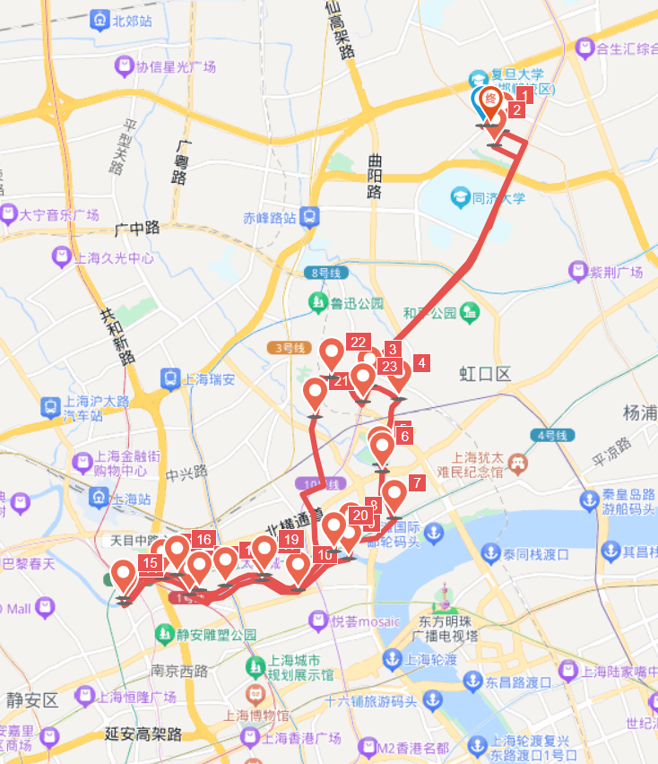

# 苏州河夜骑 30km

<figure><figcaption></figcaption></figure>

路程里程：30km

行者路书号：#3070354

骑行强度：★☆☆☆☆

路况难度：★☆☆☆☆

风景评分：★★★☆☆

建议出发时间/行程总耗时：17:30/3h

路线说明：约17:30出发，在望道旧居集合，从南区出发；

到达\[四平路]，沿四平路一直向南，在物华路左转，骑行至沙泾巷河边，沿着沙泾巷路南下，直到 \[1933老场坊]。

沿周家嘴路骑行20m过河，左转过马路进入九龙路。一直向南，到长治路右转。骑行至乍浦路左转，在\[乍浦路桥]上合影。\[四川路桥] 东侧有一加油站，可以休息。

沿苏州河南侧路段一直骑行至恒丰路桥，过桥，到达苏州河北侧，向西骑行，可在\[四行仓库]合影。 返回至四川路桥左转，一直向北，在潥阳路路口右转，返回四平路，返程。

路线亮点：

沙泾巷小路沿沙泾巷河道一路南下，路况很不错，车很少。接近周家嘴路处是1933老场坊，是老上海旧建筑改造的杰出代表。

 乍浦路桥风景非常好，东方明珠等陆家嘴标志性建筑出现在苏州河尽头，适合打卡拍照。乍浦路桥西侧是江泽民主席题写的“上海邮政博物馆”。

沿北苏州路返程时，途径著名爱国教育景点“四行仓库”。

途径不少老上海巷子，可以感受上海风土人情。

推送参考链接：【经典路线】

[https://mp.weixin.qq.com/s/1XU9DVWBn0-nRjk2tyL0jw ](https://mp.weixin.qq.com/s/1XU9DVWBn0-nRjk2tyL0jw)(2021.10.8)

[https://mp.weixin.qq.com/s/3fiKxGHLDxLVOlb2A5j09A ](https://mp.weixin.qq.com/s/3fiKxGHLDxLVOlb2A5j09A)(2021-05-17)

[https://mp.weixin.qq.com/s/dJIyxdG6NQpAAkdEpZn9gA ](https://mp.weixin.qq.com/s/dJIyxdG6NQpAAkdEpZn9gA)(2019-10-13)

[https://mp.weixin.qq.com/s/1nIYyubSj8XWTSBuoRi8ow ](https://mp.weixin.qq.com/s/1nIYyubSj8XWTSBuoRi8ow)(2019-03-13)

[https://mp.weixin.qq.com/s/\_U1LuEpPdb-699Wsz\_rm6A ](https://mp.weixin.qq.com/s/\_U1LuEpPdb-699Wsz\_rm6A)(2018.5.29)

整理人：小马
