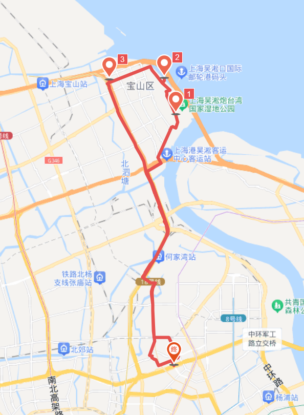

# 吴淞口 30km

<figure><figcaption></figcaption></figure>

路程里程：30km

行者路书号：#2993500

骑行强度：★☆☆☆☆

路况难度：★★☆☆☆

风景评分：★★☆☆☆

建议出发时间/行程总耗时：总耗时约3h，建议下午2:30出发，或晚饭后6:00出发

去程：国权北路、逸仙路 - 吴淞大桥一路向北，途径\[宝山滨江公园] ，然后逆时针绕一圈；

从同济路向南，经过吴淞大桥，原路返回；路书by郭子兴。

注意事项：军工路-逸仙高架路交叉口以北大车很多，烟尘严重，呼吸道敏感者请佩戴口罩。

路线亮点：白天去吴淞口可以去 \[吴淞炮台湾公园] 游玩，游玩时间约1.5h。江边风景很好，推荐在贝壳剧场处合影留念。

晚上去吴淞口可以去邮轮港码头旁边的 \[宝山滨江公园] 玩耍，欣赏江边夜景，了解宝山区居民夜晚生活，但需要注意可能不允许自行车进入。

推送参考链接：【经典路线】

[https://mp.weixin.qq.com/s/jUpwl\_CAf7JWoSy6AA4Igw ](https://mp.weixin.qq.com/s/jUpwl\_CAf7JWoSy6AA4Igw)(2022-2-26)

整理人：小马
