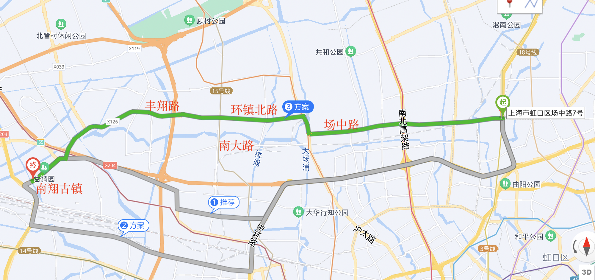
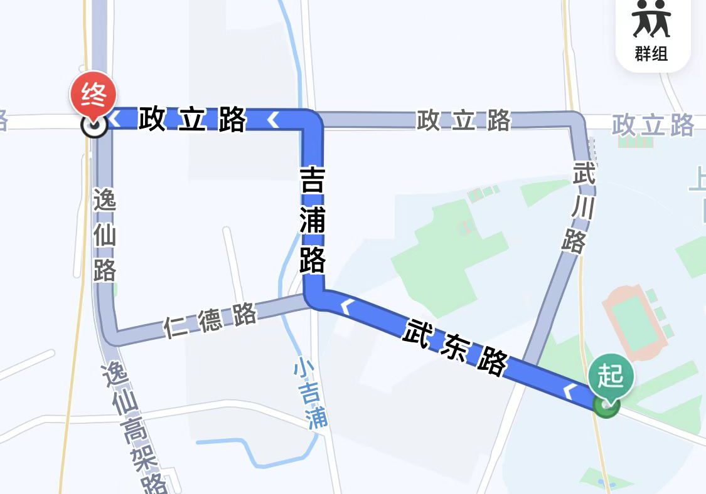
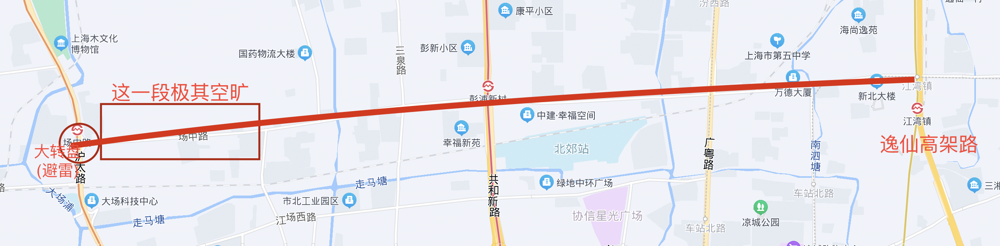
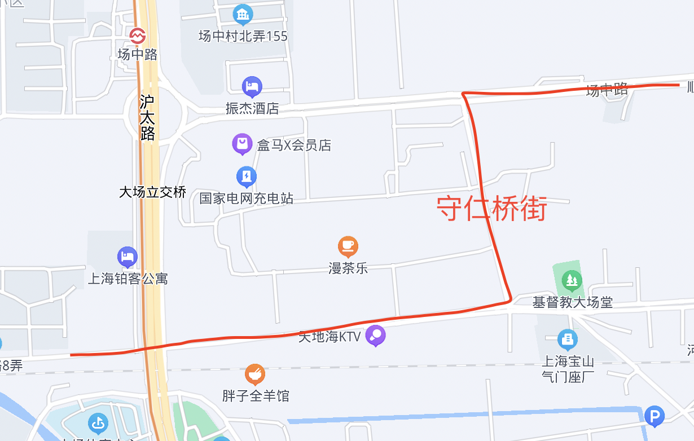
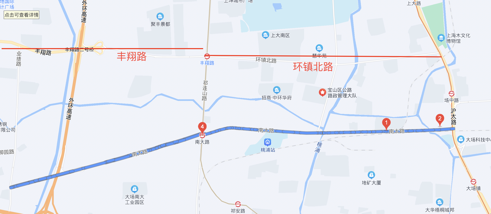

# 干线库

## 东西向

### 场中路-环镇北路-丰翔路-沪宜公路 20km

<figure><figcaption></figcaption></figure>

范围：政立路国定路路口-沪宜公路华翔路路口 (嘉闵高架路下 近南翔古镇)

经过行政区：杨浦区、虹口区、静安区、宝山区、嘉定区

说明：复旦邯郸往正西的好路，最西边可以接上南北干线华翔路

复旦上干线说明：建议北区集合出发走武东路-吉普路-政立路

<figure><figcaption></figcaption></figure>

替代：次优解南大路；

不想走西+南 - 选西南方向的干线中山北路 (市区路不好) （link to 区域1东南向干线1）

### **【推荐】场中路**

<figure><figcaption></figcaption></figure>

范围：场中路逸仙高架路路口-场中路沪太路路口

经过行政区：虹口区、静安区、宝山区

说明：路宽路好，T字路口较多，红绿灯较少；

高峰期电驴多，非高峰期可趁早拉去西边，最西边一小段高峰期也没车，边上是军事区。

大转盘往北问题不大，往南可避雷，提前一个口拐；大转盘容易错路。&#x20;

<figure><figcaption></figcaption></figure>

评分：【小马】80 2022.2；【jf】

### 【推荐】环镇北路

<figure><figcaption></figcaption></figure>

范围：环镇北路沪太路-环镇北路祁连山路

经过行政区：宝山区

说明：路好。

### 【普通】南大路

范围：南大路沪太路路口-南大路红柳路路口（接上图）

说明：路颠坑洼不平，最近在施工，土方车和扬尘多 截止2022.3；但是路宽。有家牛肉面很好吃 by jf

评分：【小马】50 (以后评分施工结束之后可期)；【jf】

替代：环镇北路+丰翔路

### 南北向

### 【比较推荐】南北高架下

范围：目前仅评测过从卢浦大桥到苏州河由南向北方向

说明：路线笔直，骑行路面较开阔，路况很好，是南下进入黄浦区/徐汇核心区干线。需要注意两点：还是应避开早晚高峰；中间有一小段路肩上部分，要控制车速。

### 线路总结

复旦出城往南路线 定位-骑游

复旦出城往北往江苏任意骑路线 定位-长距离拉爆

