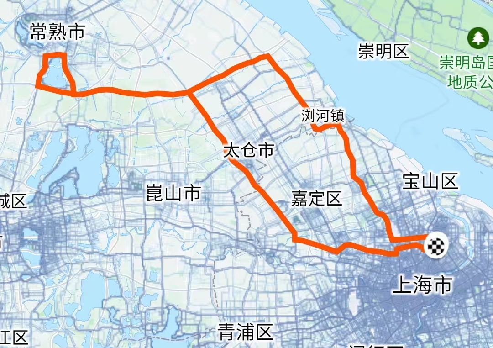

# 复旦常熟（虞山）往返 210km

<figure><figcaption>
复旦 - 常熟
</figcaption></figure>

> 平湖数百里，隐然一山起。
>
> 中有白龙泉，可洗人间耳。
>
> _——范仲淹 《留题常熟顶山僧居》_

路程里程：210km

骑行强度：★★★★★

路况指数：★★★★☆

百度路书编号：1658130 / URL：[https://map.baidu.com/zt/y2016/lushushare/detail.html?no=1658130](https://map.baidu.com/zt/y2016/lushushare/detail.html?no=1658130)

* 你的技艺将受到考验。
* 去程：吃好早饭，早些出发避免上海的早高峰时段和电瓶车噩梦，出城后的路况极好。
* 午餐：在常熟找饭店解决即可。
* _虞山爬坡_：虞山的山路平均坡度10%，最大坡度14%，是具有一定难度的爬坡赛段。需要注意的是虞山部分山路为石板路，同时交通情况较为混乱（行人、机动车、非机动车混行），事故频发，因此需要小心谨慎地骑行。同时量力而行，可以放弃爬虞山来保证返程不会脱力。
* 返程：按路书返程即可。
* 补给：中途补给点数量中等，一般为街边加油站和小商店，因此不必担心补水问题。但是，仍建议携带一些士力架、能量胶等食物补给，便于途中补充。

