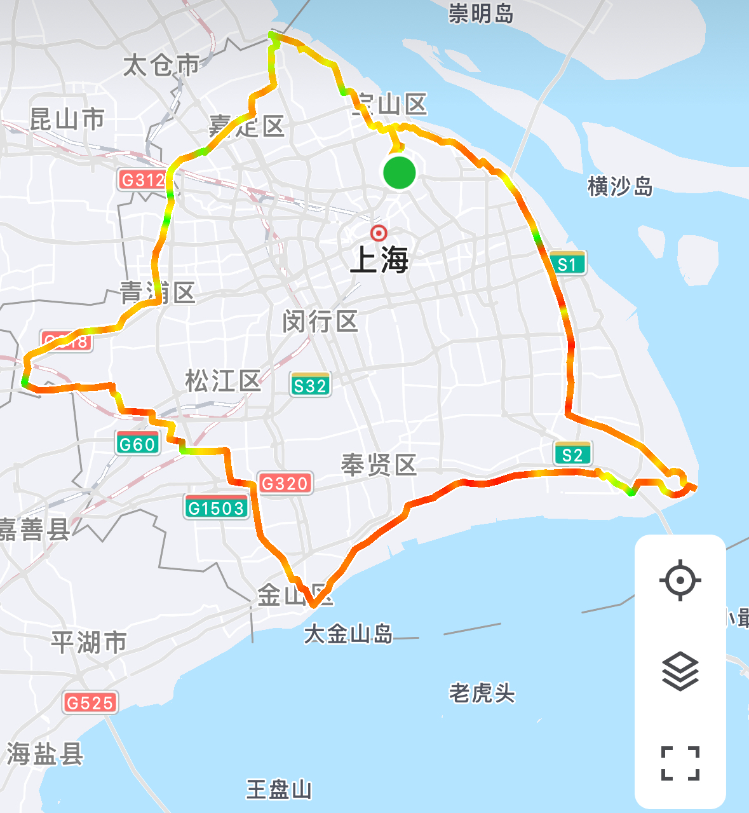

# 环上海 344km

路程里程：344km

累计爬升：600m 上海很平

骑行强度：★★★★★

行者路书号：

建议行程安排：早六点从吴淞渡口坐第一班轮渡过江，早点赶路，路上多吃。建议打卡南汇海滨，金山渔村，金泽古镇，江苏界四处上海相对最东南西北之地。前期应尽量加快速度，以减少夜骑的时间。四处打卡地应补给水和食物，以防能量不支。

整理人：董

<figure><figcaption></figcaption></figure>

