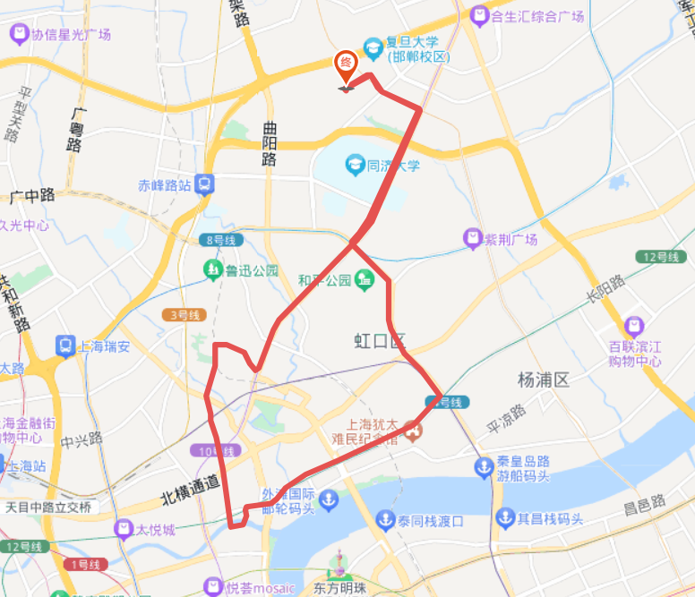

# 苏州河乍浦路桥 16km

<figure><figcaption></figcaption></figure>

路程里程：16km

行者路书号：#3439005

骑行强度：★★☆☆☆

路况指数：★★★★★

风景评分：★★★★☆

整理人：Kyre

建议出发时间/行程总耗时：快的话1h解决

路线亮点：

感觉骑车这件事是需要时常练习的，所以一直在寻找一个适合晚上小骑一下的路线，经过数个月的尝试与迭代，最终将路线固定为目前的这一条。参考了车协北外滩夜骑的路书，在这个基础上减少了许多的拐弯，去除了一段不好走的路，构建线路的时候选择了像四平路、四川北路这种十分开阔的道路。

加入了乍浦路桥这一著名景点，骑到该处把车放在桥上与东方明珠拍一张合影。桥的西侧还能够看见邮电大厦在水中的倒影。四川北路桥上的风景也不错。

但不建议在晚高峰的时候骑，电瓶车数量比较多。错开晚饭和下班时间，路面状况很不错
