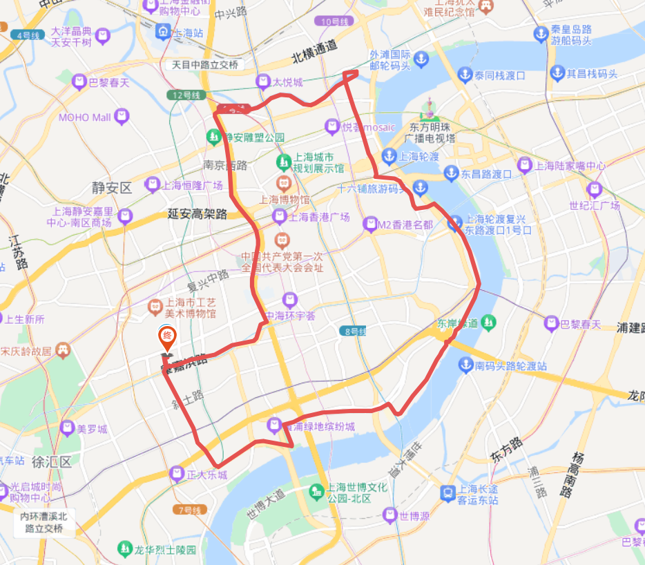

# 外马路苏州河 (枫林) 20km

<figure><figcaption></figcaption></figure>

路线里程：20km

行者路书号：#4114918

骑行强度：★☆☆☆☆

路况难度：★☆☆☆☆

风景评分：★★★☆☆

整理人：Kyre

路线亮点：苗江路，外马路，乍浦路桥，苏州河，南北高架

属于日常锻炼计划的一部分，选择了比较好骑的路。从徐汇出发，进过苗江路和外马路等开阔路段，因外滩前面不让骑车，从人民路拐到四川中路，然后向北到达四川路桥，拐到乍浦路桥上拍个照，然后沿着苏州河骑行到南北高架，一路南下返回出发点
