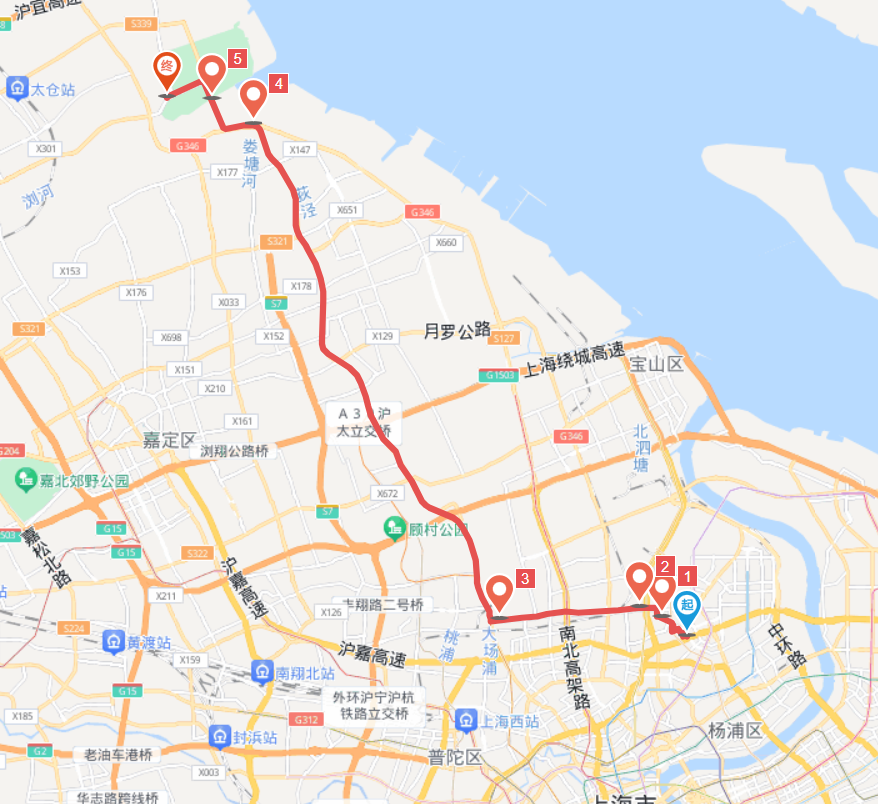

# 浏河古镇 96km

<figure><figcaption></figcaption></figure>

路程里程：96km

行者路书号：#971721

骑行强度：★★☆☆☆～★★★★★

路况指数：★★★★☆

风景评分：★★★☆☆

建议出发时间/行程总耗时：总耗时4\~10小时（取决于是拉练还是郊游）

去程：上海境内走了很多折，具体见路书，是综合来看路况较好的路线。出上海进江苏后走浏河大桥+339国道，路况怡人，绝对够爽。

午餐：地锅鸡、农家菜、牛肉汤/汤包/面馆等经典小店；如果为拉练可半日避免途中停顿。

返程：主要为沪太路+场中路，路线记起来较为便捷，但到较市中心红绿灯有点多（没办法）

路线亮点（可涵盖在去程/午餐/返程相应处or分开写）：除返程末尾部分红绿灯较多，全程极度舒畅，选择的路线多为丁字路口/国道，少停顿（多巡航），如果是拉练的话，作为百公里左右又有大桥的路线，非常适合新人为更有挑战性的路线作铺垫，熟悉路线后也可作为不太有时间的情况下抽空小拉一波的选择。如果作为郊游，路况较优也是很不错的选择，途径浏河大桥可打卡海景，目的地浏河古镇风景也不错，不过不要被推送骗得期望太高，浏河古镇规模较小，可供观玩的只有一条街，但也足够让人欣赏到典型的古镇风情。上海段多树荫，夏天不会太晒，江苏段半程有树，半程空旷，夏天去的同学们要做好防晒工作，防止中暑，不过临近海边，骑得够快的话海风拂面还是很凉快的。全程唯一需要注意的不太好的路况就是去程的数个以人行道砖进行铺设的桥面，会震得你酥酥麻麻，其他都很nice，放心享用。

推送参考链接：[https://mp.weixin.qq.com/s/F-2FvwEFjrU7Ja\_fF7XFeg ](https://mp.weixin.qq.com/s/F-2FvwEFjrU7Ja\_fF7XFeg)

整理人：柳海龙
