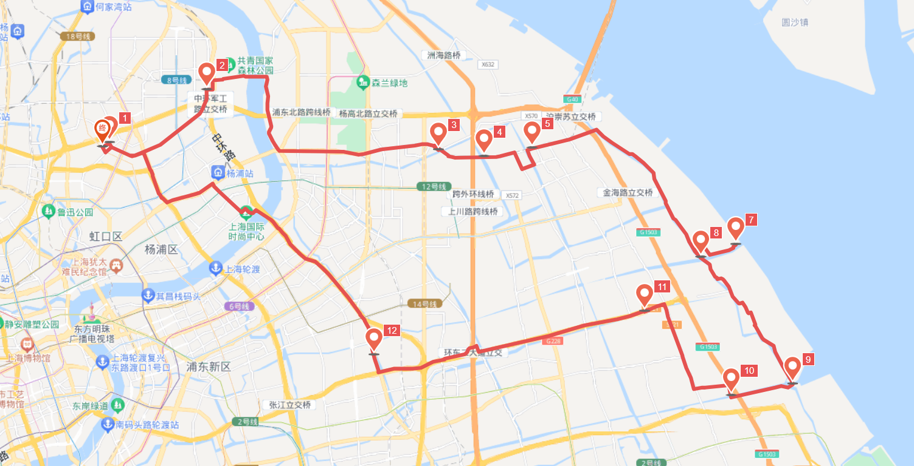

# Seawall 人民塘路/三甲港 75km

<figure><figcaption></figcaption></figure>

路程里程：75km

行者路书号：#3066650

骑行强度：★★★☆☆

路况指数：★★★★☆

风景评分：★★★☆☆

行程总耗时：早上8:30出发，慢悠悠的游玩下午4:00左右可返回学校。

去程：\[国顺东路]、\[东嫩线轮渡]、\[东塘公路]、\[东靖路]、到达seawall\[人民塘路]。

返程：可走\[华夏东路/龙东大道]、之后走\[金桥路]、和\[金定线]，之后在\[丁海桥渡口]坐船前往浦西

午餐：东方现代商业广场附近

路线亮点：

\[人民塘路] 是这次活动的重点，是一条景色优美的郊游路线，道路较窄但路口较好。

\[龙东高架路]路况较好，平整的柏油路面，有隔离带分出了独立的自行车道，红绿灯较少，可以较快向东穿过浦东较为繁华的地带。接近\[凌空北路]处有一加油站，可作为补给点。

推送参考链接：[https://mp.weixin.qq.com/s/yUTSevcGJCRNPkH1WbtWFw ](https://mp.weixin.qq.com/s/yUTSevcGJCRNPkH1WbtWFw)(2021.11.14)

整理人：王凯航
