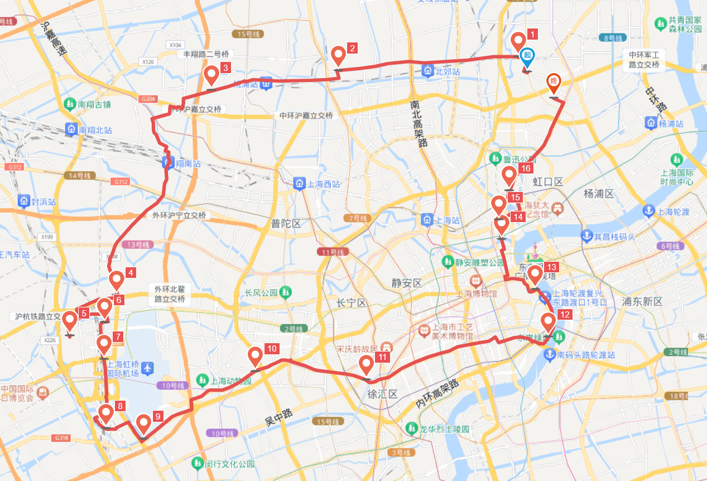

# 申兰路萌新猛新骑 70km

<figure><figcaption></figcaption></figure>

路程里程：70km

行者路书号：#3133470

骑行强度：★★★☆☆～★★★★★（从1到无穷大）

路况指数：★★★☆☆

风景评分：★★★☆☆

行程总耗时：(需补充)

去程：北区出发后可走【场中路向西干线】、之后可走\[南大路]。也可以选择\[环镇北路]、\[丰翔路]到\[南翔古镇]， 然后前往\[南嘉闵高架]。申兰路刷圈线路6km

返程：\[虹桥路]、\[肇嘉浜/斜土路]、一路向东到\[南浦大桥]，沿\[外马路]向北，经过\[四川路 - 四川路桥 - 四平路]返回学校。

午餐：良化广场麦当劳，店大、可通过透明窗户可看车。

路线亮点（卖家秀）：

1\.  天山西路看飞机

2\.  申兰路刷圈（萌新休闲，猛新拉爆，两个愿望，一次满足！）

对萌新：先骑半程，到达麦当劳就餐，然后可以午休补充体力，或者来体验几圈申兰路真·休闲·荡腿骑，或者现场围观车队大腿们的现场肌肉拉扯；

对猛新：到申兰路后，可以跟在车队大佬后面ttt，或者自己itt，或者拉爆车队菜腿。可以连续itt骑行挑战车队入队队标(10km 17.6min 34km/h)，也可以间歇式骑行。计划刷圈30分钟，然后就餐。

ttt: Team Time Trial 团队计时赛

itt: Individual Time Trial 个人计时赛 - 此指跟车骑行和独立骑行两种形式。

3\.  骑在滨江外马路，眺望浦东三件套

4\.  黄浦区穿梭在新老建筑间，感觉到时间的暂停；

推送参考链接：[https://mp.weixin.qq.com/s/rby4Sjonkzbi4xDBgvXDQQ ](https://mp.weixin.qq.com/s/rby4Sjonkzbi4xDBgvXDQQ)

整理人：王凯航、小马

## 骑友评价

春天就要去申兰路看飞机，顺便拉爆自己。——孙秦陇

第一次上锁，万幸没有零速摔（两次差点摔刚好旁边有栏杆能扶）

第一次90km（早知道差一点100km就去申兰路多刷两圈）

第一次被拉爆（被pro们拉上40然后心率很快爆掉）

第一次知道自己的腿有多菜（6km均速29，距离入队标准还有很大一段距离）

第一次码表骑到半路没电（错失完美矩形路线图）

希望还有不止一次x复旦车协 ——卢羿舟

