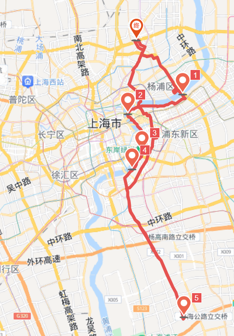

# 召稼楼古镇 65km

⚠（2024.3.31）召稼楼古镇现暂停开放，具体恢复时间等待官方通知

<figure><figcaption></figcaption></figure>

路程里程：65km

行者路书号：#3126804

骑行强度：★★☆☆☆

路况指数：★★★☆☆

风景评分：★★★★☆

建议出发时间/行程总耗时：

去程：3h

午餐：建议再召稼楼古镇里面逛一逛，里面吃饭的地方不少。古镇开发程度比较高，如果想体验安静的古镇，可以晚上5:30之后去。

返程：3h

路线亮点：召稼楼古镇在浦东，建议去程或返程走浦东滨江大道，骑行环境好一些，而且算下来不用等红绿灯，其实也不慢。

召稼楼古镇本身与其他上海市内和上海市周围的已开发的古镇差不多，也有那些全国旅游景点都能吃到的小吃和全国都能买到的旅游纪念品。可能其中的笋干和蹄髈比较出名，也算是地方特色。

推送参考链接：https://mp.weixin.qq.com/s/uG7UU\_FMdLL0mtBLkgJL5Q

整理人：辛昊霖
